# Desktop Widgets

Backup of the custom widgets built on top of
[dagyr.desktop-widgets](https://github.com/cyelis1224/omarchy-desktop-widgets)
(Omarchy's desktop widget plugin). Everything here lives inside that plugin's
folder, `~/.config/omarchy/plugins/dagyr.desktop-widgets/`. This repo is an
overlay: only the files that are new or changed relative to upstream.

Note: Not a finalized list I add new widgets/tweak existing widgets as I tryout new settings and features.

## Widgets

| Widget | File | What it does |
| --- | --- | --- |
| **Horizon Clock & Weather** | `HorizonClockWidget.qml` | Fork of Hero Clock & Weather that's resizable: greeting, weather, time and date scale together to fit centred in whatever size the card is dragged to (160×80 up to wall-sized). Right-click to pick any installed Nerd Font (searchable, previewed in-font), plus Hero's 12/24h, seconds, compact date, °F/°C and greeting options. |
| **Karaoke Player** | `MprisPlayerWidget.qml` + `get-lyrics.sh`, `get-mute.sh` | Wireframe spinning-record player for any MPRIS source. Seekable progress, prev/play/next, live cava spectrum, source chips (scroll to cycle), synced karaoke-style lyrics from a local `.lrc` or LRCLIB, beside or below the controls. Per-track timing nudge, lyric size S–XXL, refresh button to re-fetch lyrics past the cache. Space/M hotkeys on hover (M mutes that app's own audio stream). Scales from 260×150 to wall-sized. |
| **Video Player** | `VideoPlayerWidget.qml` + `get-video.sh`, `get-youtube.sh` | Loops a local video, or a YouTube URL downloaded via yt-dlp to a cache. Volume/mute, scroll-wheel scrubbing, Space/M hotkeys on hover, double-click fullscreen. Optional *Hide While Paused*: the widget fades out while paused and back in on hover over the whole panel, its centre, or the control bar (your pick). |
| **Visit Another Realm** | `RealmPortalWidget.qml` + `get-random-game.sh` | One button launches a random installed game from Steam, Heroic or Lutris, over shuffling cover-art swatches (angle: ╲ │ ╱). Custom title/button text, icon picker, per-game exclusion list. |
| **Abyss Warden** | `AbyssWardenWidget.qml` + `AbyssEye.qml`, `AbyssEyes.qml`, `AbyssBeholder.qml`, `get-abyss-watch.sh` | An anime eye that only appears while the screen is being recorded: Omarchy's recorder, wf-recorder/wl-screenrec, or any portal capture (OBS, Discord, browser screen share). Awake, it follows the mouse, glances at windows whose title changes, darts around and stares at the viewer, and blinks. Right-click: one eye, a pair, or a mini Beholder (body, grin, eyestalks with little eyes), an Eye Size slider, 9 eye styles (Classic, Sparkle, Starry, Sharp, Glare, Shocked, Hypnotic, Shoujo, Angular) and 11 iris styles usable on any of them (Cel, Sparkle, Starlight, Rings, Blossom, Spiral, Hollow, Crosshair, Heart, Pinpoint, Slit, plus Naruto's Sharingan I–III, two Mangekyō, Rinnegan and Byakugan in their own colours) in foldable menu sections, Free-Floating mode (click-through, drifts around the screen; a pair drifts together), card background, 15s preview, and 10 eye themes (incl. Riso Room, Petal Dusk, Pinwheel Summer) or the system theme, with a Full Theme Palette toggle (all theme hues vs accent only). Drawn in a flat cel-shaded riso-print style: halftone shadows, coloured ink lines, paper grain, offset print colour. Takes an interest in what you click (narrows in and scans the window; floating flies over beside it) freezes then chases rapid mouse movement, and now and then wanders off to trace a window's edge or check the bar before coming back to the mouse. Clicks need one line in `~/.config/hypr/bindings.lua`: `hl.bind("mouse:272", hl.dsp.event("abyss-click"), { non_consuming = true })` (non-consuming, so clicks still reach apps). |
| **System Monitor** | `SystemMonitorWidget.qml` + `get-sysmon.sh`, `get-agents.sh` | CPU/RAM/GPU meters, network rates and session totals, and AI agent usage-limit bars (from Omarchy's agent-usage data). |
| **About This System** | `SystemAboutWidget.qml` + `get-about.sh` | fastfetch-style summary plus the active theme's colour swatches. |
| **Quick Launch Grid** | `AppGridWidget.qml` | Paged 3×3 / 4×4 / 5×5 grid of pinned apps. Right-click to rename the title, pick its glyph from a searchable dropdown of every icon in your system font, or hide either (hide both and the apps take the whole card). |

Edits to upstream files (in `patches/upstream-edits.patch`, full copies in
`plugin/`):

- `widgets/WidgetRegistry.qml` registers all of the above in Add Widgets.
- `components/WidgetSelector.qml` lets a widget show more than one badge in
  Add Widgets.
- `widgets/quick-notes/QuickNotesWidget.qml` reloads live when `notes.json`
  changes on disk.
- `manage-positions.sh`, `get-photos.sh`, `get-network.sh` save the state file
  safely (locked, atomic), so two saves at once can no longer wipe your
  layout presets.

## Screenshots

Sorted by widget; the originals are in [`screenshots/`](screenshots/).

### Horizon Clock & Weather

The big clock behind Abyss Warden in [these shots](#abyss-warden).

### Karaoke Player

<p>
  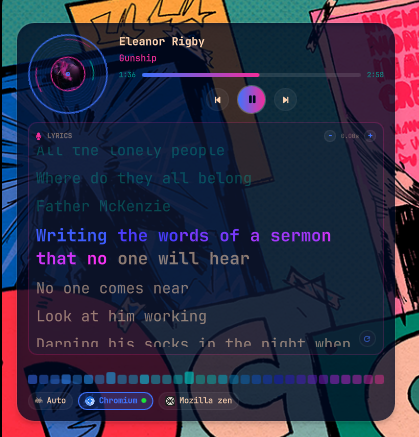
  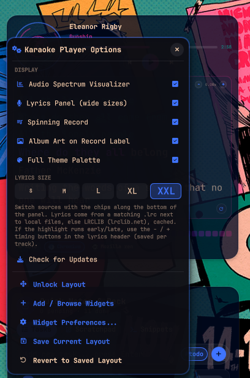
</p>

### Video Player

<p>
  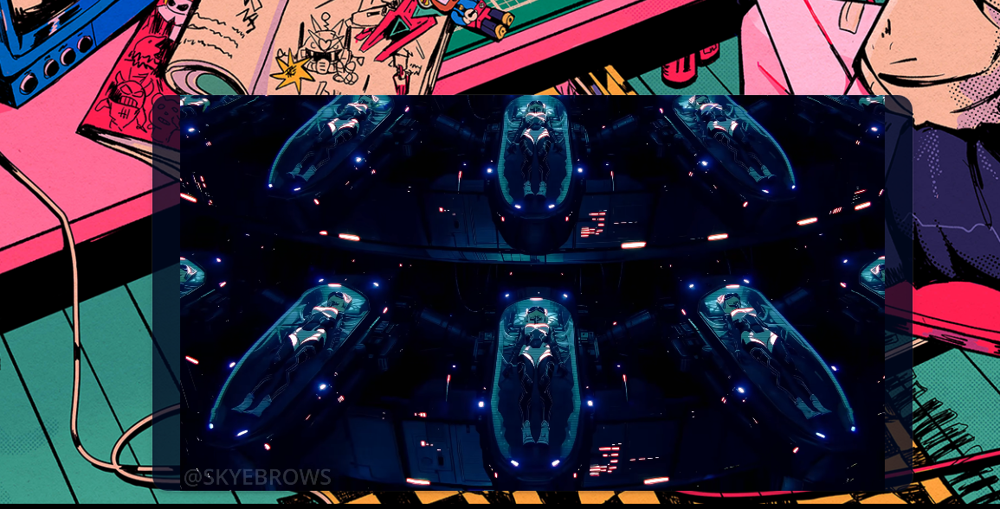
  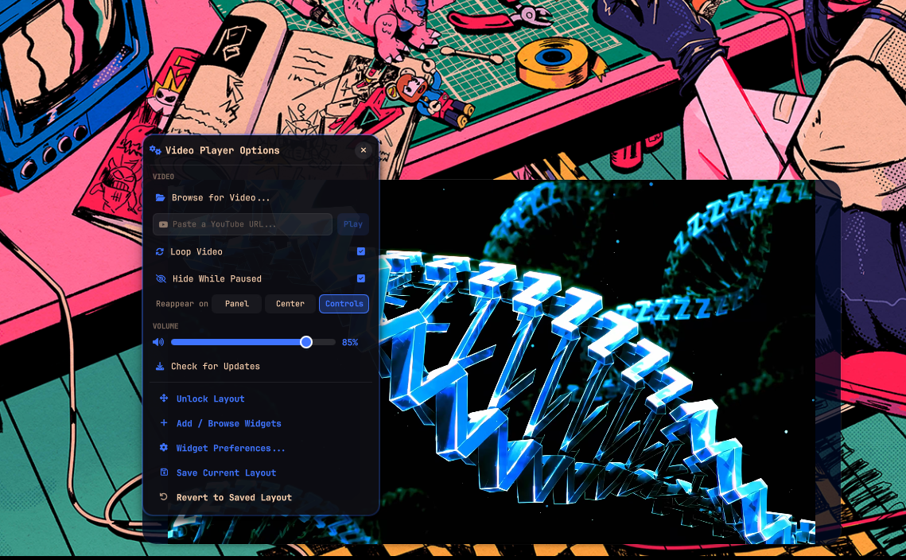
</p>

### Visit Another Realm

<p>
  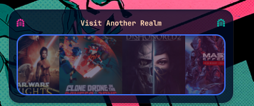
  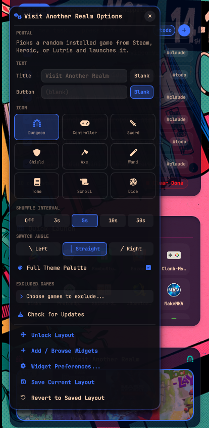
</p>

### Abyss Warden

<p>
 | 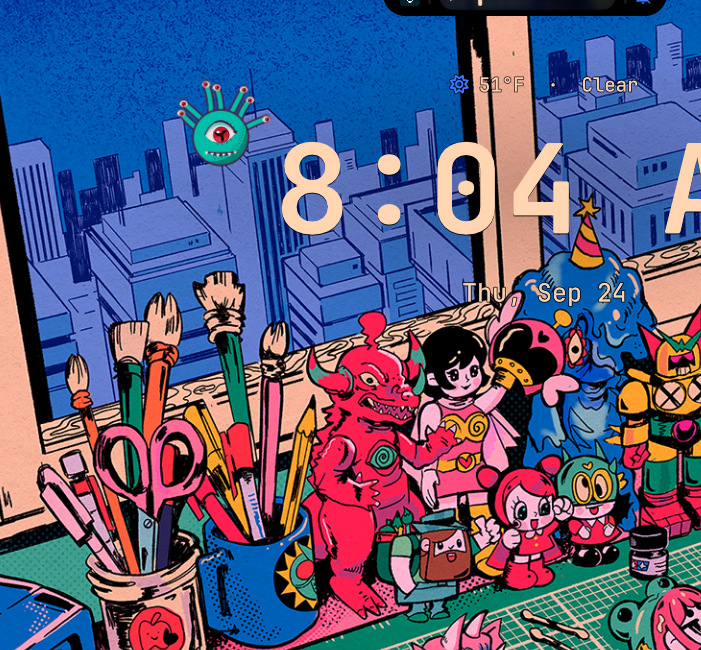 |
    | 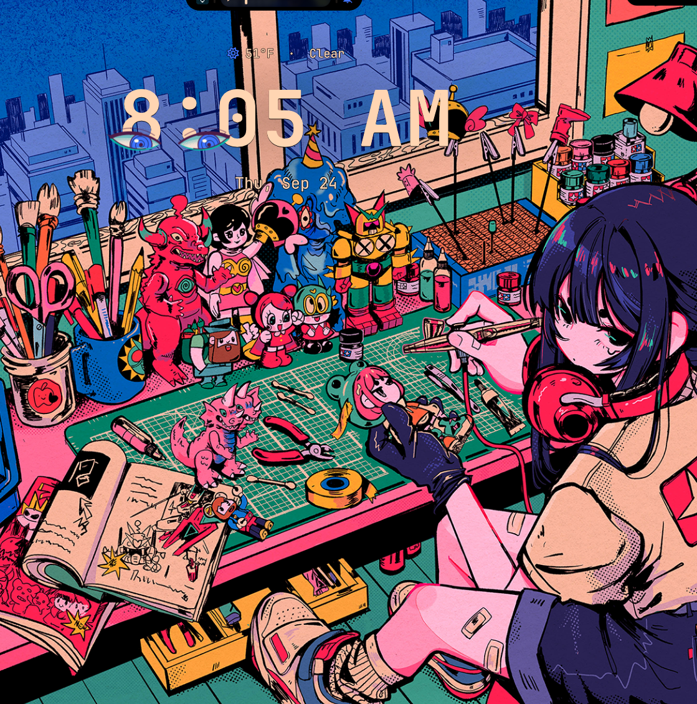 |
  | 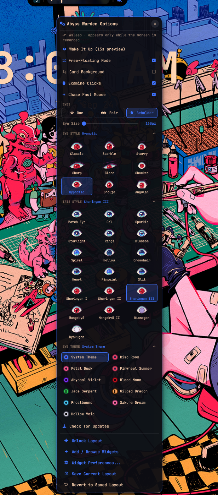 |
</p>

### System Monitor

<p>
  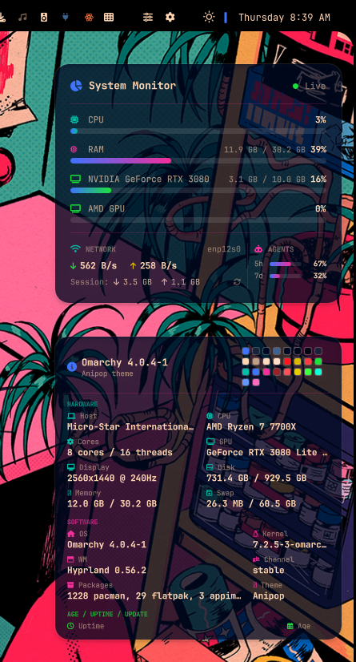
  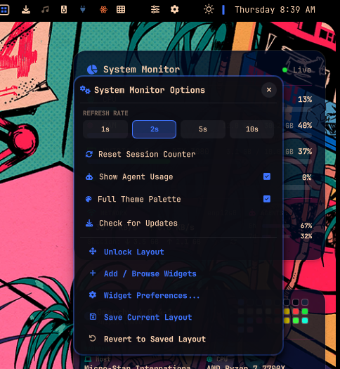
</p>

### About This System

Shown under System Monitor [above](#system-monitor).

<p>
  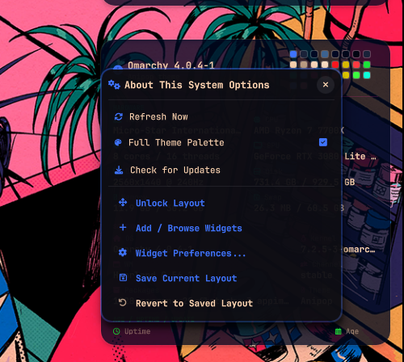
</p>

### Quick Launch Grid

<p>
  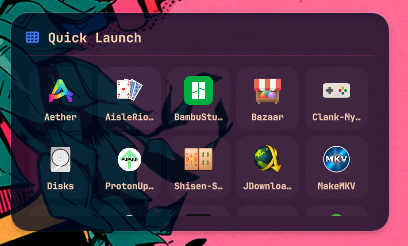
  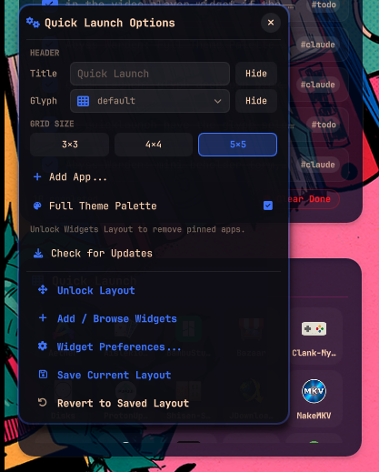
</p>

## Updating

Every custom widget's right-click menu ends with **Check for Updates**. It compares the installed version with this repo; if there's something new it lists the commits and a second click installs the whole suite (same as re-running the one-line installer: `install.sh` backs up anything it replaces) and reloads the shell.

## Install / restore

### One-line install

```sh
bash <(curl -fsSL https://raw.githubusercontent.com/DasPoxy/omarchy-desktop-widgets-daspoxy-collection/main/bootstrap.sh)
```

This checks that [dagyr.desktop-widgets](https://github.com/cyelis1224/omarchy-desktop-widgets)
is installed and stops with a link to it if it isn't. Otherwise it clones this
repo to `~/.local/share/desktop-widgets` (or pulls it if it's already there)
and runs `install.sh` from it. Then reload the shell:

```sh
rm -rf ~/.cache/quickshell/qmlcache && omarchy-restart-shell
```

Re-run the same line to update.

### Manual

1. Install the upstream plugin first. `UPSTREAM` records the repo and commit
   these were built on.
2. Clone this repo and run the installer:
   ```sh
   git clone https://github.com/DasPoxy/omarchy-desktop-widgets-daspoxy-collection.git
   cd desktop-widgets && ./install.sh
   ```
   It copies the new files in. For the two edited upstream
   files, it copies them outright if the plugin is at the recorded commit, and
   otherwise applies just our edits as a patch, so a newer upstream isn't
   overwritten. Anything it replaces is backed up under
   `~/.local/state/omarchy/`. Re-running it is safe.
3. Reload: `rm -rf ~/.cache/quickshell/qmlcache && omarchy-restart-shell`
4. Layout presets are in `layouts/`. Import them from the desktop
   right-click → layout presets → Import.

A plugin update (`git pull` in the plugin) leaves the new files alone but may
revert the two upstream edits. Re-run the one-line installer (or
`./install.sh`) afterwards.

## Keeping this backup current

```sh
./sync.sh        # pulls every new/changed file from the live plugin + exports custom layouts
git add -A && git commit -m "..." && git push
```

`sync.sh` works out the file list from the plugin's own `git status`, so new
widgets are picked up automatically.

## Runtime dependencies

`python3`, `yt-dlp` + `ffmpeg` (YouTube), `cava` (spectrum, optional), `pactl`
+ `busctl` (per-app mute), `sqlite3` Python module (Lutris), and
`omarchy-agent-usage-update` (agent bars, ships with Omarchy).
